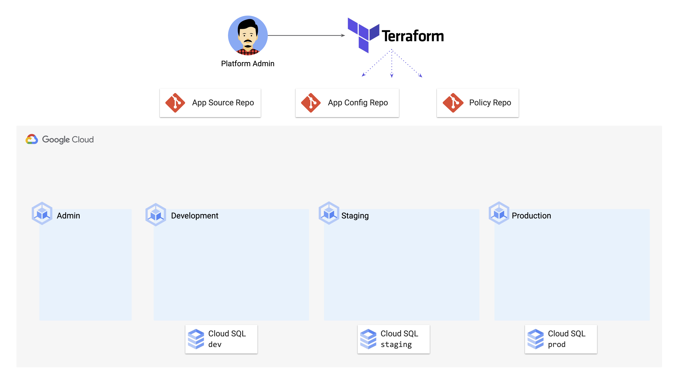

# 1 - Setup 

This directory contains Terraform resources to set up a demo environment in a Google Cloud project, along with three Github repos. 

## Architecture 



The diagram above shows the baseline resources Terraform will create during setup: 

- **4 GKE clusters** for admin, dev, staging, and prod. The admin cluster has [**Config Connector**](https://cloud.google.com/config-connector/docs/overview) enabled, which will be used in a later demo.
- **3 Cloud SQL** databases for dev, staging, and prod. 
- **3 Github repos** for app source, app config, and policy. 
- **3 Secret Manager secrets** containing your Github username and token. 

## Prerequisites 

1. **A local development environment**, either Linux or MacOS, into which you can install command-line tools. 
2. An **Google Cloud project**, with billing enabled. Have the Project ID handy. *A note to Googlers* - it's recommended that you use a project in an external organization. 
3. A **Github account**. 
4. A [**Github Personal Access token**](https://docs.github.com/en/github/authenticating-to-github/creating-a-personal-access-token) with repo creation permissions. 

## Steps 

### 1. Install the following tools. 

(You might have some of these installed already.) You'll use these tools throughout the demos. 

- [gcloud](https://cloud.google.com/sdk/docs/install)
- [kubectl](https://cloud.google.com/sdk/gcloud/reference/components/install)
- [kubectx](https://github.com/ahmetb/kubectx#installation)
- [terraform](https://learn.hashicorp.com/tutorials/terraform/install-cli) 
- **tree** - `brew install tree` (MacOS)
- [Docker desktop](https://www.docker.com/products/docker-desktop) (Mac) or [Docker Engine](https://docs.docker.com/engine/install/ubuntu/) (Linux)
- [skaffold](https://skaffold.dev/docs/install/). 
- [Java - JDK 14](https://www.oracle.com/java/technologies/javase-downloads.html)
- [Maven (Java)](https://maven.apache.org/install.html)
- [VSCode](https://code.visualstudio.com/Download)
- [Cloud Code Extension for VSCode](https://cloud.google.com/code/docs/vscode/install) 


### 2. **Open a terminal, and clone this repo.**

```
git clone https://github.com/askmeegs/intro-to-krm
cd intro-to-krm/1-setup/ 
```

###  3. **Set variables**. 

```
export PROJECT_ID="<your-project-id>" 
export GITHUB_USERNAME="<your-github-username>"
```

###  4. **Enable Google Cloud APIs** in your project. This command takes a minute to run.

```
gcloud config set project ${PROJECT_ID}
gcloud services enable \
  container.googleapis.com \
  cloudbuild.googleapis.com \
  sqladmin.googleapis.com \
  secretmanager.googleapis.com \
  cloudasset.googleapis.com \
  storage.googleapis.com
```

### 5. **Get the project number corresponding to your project ID.** 

```
PROJECT=$(gcloud config get-value project)
gcloud projects list --filter="$PROJECT" --format="value(PROJECT_NUMBER)"
```

### 6. **Replace the values in `terraform.tfvars`** with the values corresponding to your project. 

```
project_id = ""
project_number = ""
github_username = ""
github_token = ""
```

### 7. **Set up application default credentials** for your project - this allows Terraform to create GCP resources on your behalf. 

```
gcloud auth application-default login
```

### 8. **Run `terraform init`.** This downloads the providers (Github, Google Cloud) needed for setup. On success, you should see: 

```
terraform init 
```

Expected output: 

```
Terraform has been successfully initialized!
```

### 9. **Run `terraform plan`.** This looks at the `.tf` files in the directory and tells you what it will deploy to your Google Cloud project. 


```
terraform plan
```

Expected output: 

```
Plan: 35 to add, 0 to change, 0 to destroy.

Changes to Outputs:
  + kubernetes_admin_cluster_name   = "cymbal-admin"
  + kubernetes_dev_cluster_name     = "cymbal-dev"
  + kubernetes_prod_cluster_name    = "cymbal-prod"
  + kubernetes_staging_cluster_name = "cymbal-staging"

```

### 10.  **Run `terraform apply`** to create the resources.

It will take a few minutes for Terraform to set up the cluster and the Cloud Build pipeline. When the command completes, you should see something similar to this: 

```
terraform apply -auto-approve
```

Expected output: 

```
Apply complete! Resources: 35 added, 0 changed, 0 destroyed.

Outputs:

kubernetes_admin_cluster_name = "cymbal-admin"
kubernetes_dev_cluster_name = "cymbal-dev"
kubernetes_prod_cluster_name = "cymbal-prod"
kubernetes_staging_cluster_name = "cymbal-staging"
```


### 11. **Run the cluster setup script.** 

This registers the clusters to the Anthos dashboard, sets up Kubernetes contexts, and sets up the Kubernetes namespaces you'll deploy the application into, in the next demo.

```
./cluster-setup.sh
```

Expected output: 

```
✅ GKE Cluster Setup Complete.
```

###  12.  **Verify that you can now access your different clusters as follows:** 

```
kubectx cymbal-prod 
kubectl get nodes
```

Expected output: 

```
Switched to context "cymbal-prod".
NAME                                                  STATUS   ROLES    AGE   VERSION
gke-cymbal-prod-cymbal-prod-node-pool-de8b1260-7np8   Ready    <none>   15m   v1.18.16-gke.302
gke-cymbal-prod-cymbal-prod-node-pool-de8b1260-mdts   Ready    <none>   15m   v1.18.16-gke.302
gke-cymbal-prod-cymbal-prod-node-pool-de8b1260-n9hw   Ready    <none>   15m   v1.18.16-gke.302
gke-cymbal-prod-cymbal-prod-node-pool-de8b1260-wv69   Ready    <none>   15m   v1.18.16-gke.302
```

###  🎊 **Congrats**! You just set up the GKE environment you'll use for the rest of the demos.

###  **[Continue to Part 2- How KRM Works.](/2-how-krm-works/)**
