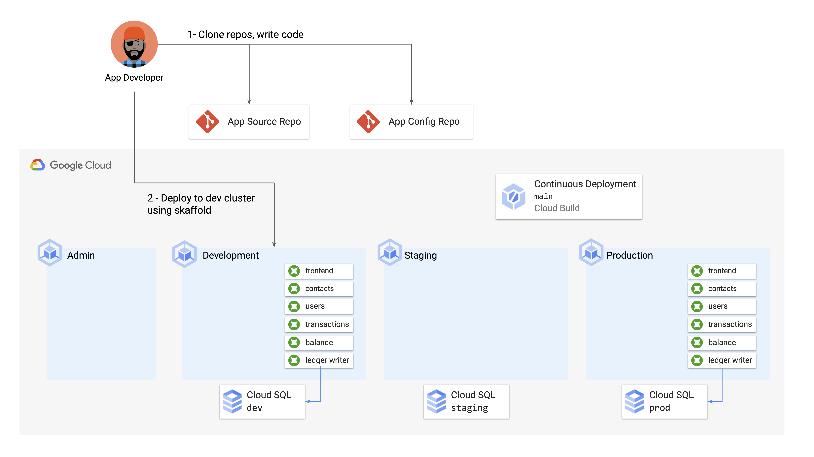
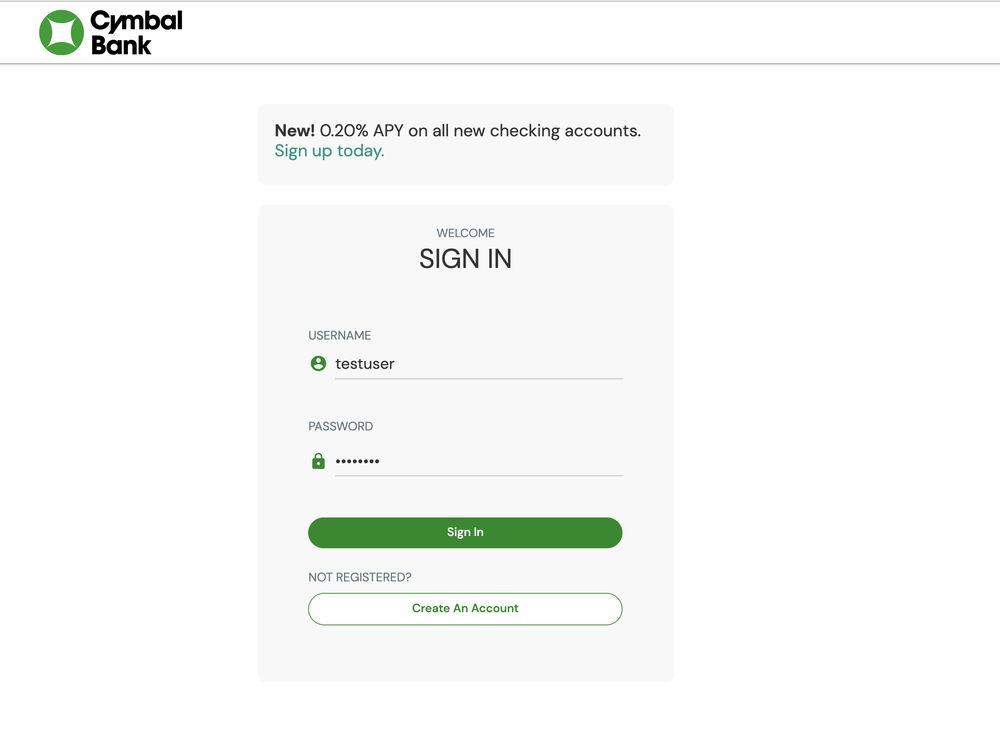

## Part C - Test the frontend feature 



Now we're ready to test our new login screen banner, and make sure it looks the way we want before we put out a Pull Request.

We *could* run the frontend Python server locally, without containerizing it, but then we have to worry about running (or mocking) the backends and databases. So what we can do instead is deploy the entire app - with the frontend code changes - to the Development GKE cluster we set up in part 1. The benefit of doing this, from a developer's perspective, is that it closely mimics the environment running in production.

To deploy the app to the dev cluster, we will use [Google Cloud Code](https://cloud.google.com/code/docs/vscode/features), backed by [`skaffold`](https://skaffold.dev/docs/quickstart/). Cloud Code is a Google Cloud tool designed to make it easier for app developers to build and deploy on top of Google Cloud infrastructure, including GKE but also other platforms like Cloud Run. Cloud Code runs inside a developer's IDE, and provides support for YAML linting, debugging, port-forwarding, and streaming logs.  

[skaffold](https://skaffold.dev/docs/quickstart/) is a command-line tool that can auto-build and auto-deploy source code into GKE, using container builders like Docker. 

1. **View the `skaffold.yaml` file in the `app-dev/` directory**. 

```
cat ../skaffold.yaml 
```

Expected output: 

```
apiVersion: skaffold/v2alpha4
kind: Config
build:
  artifacts:
  - image: frontend
    context: src/frontend
  - image: ledgerwriter
    jib:
      project: src/ledgerwriter
  - image: balancereader
    jib:
      project: src/balancereader
  - image: transactionhistory
    jib:
      project: src/transactionhistory
  - image: contacts
    context: src/contacts
  - image: userservice
    context: src/userservice
  - image: loadgenerator
    context: src/loadgenerator
  tagPolicy:
    gitCommit: {}
  local: 
    concurrency: 4 
  googleCloudBuild:
    concurrency: 4 
deploy:
  statusCheckDeadlineSeconds: 300
  kustomize: {}
profiles:
  - name: dev
    deploy: 
      kustomize: 
        paths:
          - "cymbalbank-app-config/overlays/dev"
  - name: staging
    deploy: 
      kustomize: 
        paths:
          - "cymbalbank-app-config/overlays/prod"
  - name: prod
    deploy: 
      kustomize: 
        paths:
          - "cymbalbank-app-config/overlays/prod"

```

A [skaffold.yaml](https://skaffold.dev/docs/references/yaml/) file is the configuration for skaffold. It tells skaffold where the source code lives for the various Cymbal Bank services, and where the YAML files live for Kubernetes. Here, we configure skaffold to use the kustomize overlays we explored in Part 2, mapping the skaffold `dev` **[profile](https://skaffold.dev/docs/environment/profiles/)** to the kustomize dev overlay. We also define skaffold profiles for staging and prod, both of which use the `prod` overlay, for simplicity. 


telling it what images it needs to build, where the source code lives, and any custom "profiles". In this case, we define three profiles - `dev`, `staging`, and `prod` - that deploy the relevant kustomize overlays we explored in [Part 2](/2-how-krm-works/). Also note that the Java images will be built with [Jib](https://github.com/GoogleContainerTools/jib/), a container building tool for Java, and the Python images (frontend, userservice, contacts, loadgenerator) will be built with the default Docker. 

1. **Copy `skaffold.yaml`** into your app source repo. 

```
cp ../skaffold.yaml .
```


3. **Build and deploy the images to the dev cluster**. 

- With `skaffold.yaml` open in VSCode, press `shift-command-p`.
- In the command prompt that appears, type `Cloud Code: Debug on Kubernetes`. A drop-down option should appear; click it. 
- In the skaffold.yaml prompt that appears, choose `cymbalbank-app-source/skaffold.yaml` 

![screenshot]  

- In the "profiles" prompt that appears, choose `dev`. 


- In the kubecontext prompt that appears, choose `cymbal-dev` 


- In the "image registry" prompt that appears, set to: `gcr.io/<project-id></project-id>/cymbal-bank`, replacing `project-id` with your project ID. 


A terminal should open up within VSCode that shows the skaffold logs, as it builds images and deploys to the dev cluster. This will take 3-5 minutes. 

Expected Cloud Code output: 

```
**************URLs*****************
Debuggable container started pod/balancereader-7d87ddb588-mx25g:balancereader (balancereader)
Debuggable container started pod/ledgerwriter-5f45c577-ndl55:ledgerwriter (ledgerwriter)
Debuggable container started pod/transactionhistory-7984675b8d-5fpp7:transactionhistory (transactionhistory)
Update succeeded
***********************************
```

4. **Open a new terminal window and view your newly-built pods**. 

```
kubectl get pods --all-namespaces --selector=org=cymbal-bank
```

Expected output: 

```
NAMESPACE            NAME                                  READY   STATUS    RESTARTS   AGE
balancereader        balancereader-55dc9b5878-jjbfp        2/2     Running   0          112s
contacts             contacts-66b888c46c-ntkms             2/2     Running   0          112s
frontend             frontend-5687494d77-rh58h             1/1     Running   0          112s
ledgerwriter         ledgerwriter-5876d47fd6-g6hm8         2/2     Running   0          111s
loadgenerator        loadgenerator-ffd746b7f-q59z9         1/1     Running   0          111s
transactionhistory   transactionhistory-68c4b9ccd6-nwh24   2/2     Running   0          111s
userservice          userservice-558fcc7fc4-fndgm          2/2     Running   0          111s
```

5. View the new frontend banner running on the dev cluster.

Copy the `EXTERNAL_IP` of your frontend service, paste  it on a browser, and navigate to the frontend's login screen. 

```
kubectl get svc -n frontend frontend 
```

You should see your new banner at the top of the login screen: 



