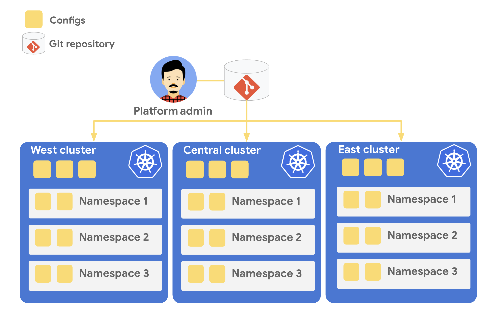

# Part B - Keeping Resources in Sync

You might be asking yourself why we just set up another repo to store KRM, and another mechanism - beyond the Cloud Build CI/CD we already have - to deploy KRM to our clusters. The answer has to do with the way Config Sync works. Unlike CI/CD, Config Sync is *constantly* making sure the Git resources are in sync on the cluster. Deployment doesn't just happen on a build trigger - it's a continuous reconciliation loop between what's in Git, and what is deplyed on the cluster.



*[source - Config Sync documentation](https://cloud.google.com/kubernetes-engine/docs/add-on/config-sync/config-sync-overview)*

What this means is that if a developer tries to manually delete a resource that lives in the cymbalbank-policy repo, Config Sync notices, and it will block that developer from doing so. If a bad actor gains access to the cluster and *does* successfully delete the resource, Config Sync will bring it back online. When the live state of the cluster diverges from the source-of-truth in Git, this is called **configuration drift**, and Config Sync is great at preventing that. 

Further, Config Sync works really well for certain types of platform-level KRM resources that might apply to all the Cymbal bank teams - think authentication policies, or base-layer workloads for monitoring. CI/CD works well for application workloads that are tied to source code and pull requests. Both tools handle KRM, but they are complementary and as we'll see later in this demo, they can be used together to powerful effect. 

Let's explore how we can use Config Sync to keep the same resources constantly deployed across all the Cymbal Bank clusters.  

1. **Get the `frontend` namespace in the `cymbal-dev` cluster.** 
  
We created this namespace manually during part 1, but now it's being managed by Config Sync.  

```
kubectx cymbal-dev
kubectl get namespace frontend -o yaml 
```

Expected output (trimmed): 

```
apiVersion: v1
kind: Namespace
metadata:
  annotations:
    config.k8s.io/owning-inventory: config-management-system_root-sync
    configmanagement.gke.io/cluster-name: cymbal-dev
    configmanagement.gke.io/managed: enabled
```

You can see that a set of new `configmanagement` annotations have been added to the existing namespace, including  `configmanagement.gke.io/managed: enabled`. This annotation indicates that Config Sync is responsible for managing this resource, keeping it synced with the cymbalbank-policy repo. 

Where did this resource come from? Let's explore the structure of the policy repo. 

2. **Run the `tree` command on the newly-initialized `cymbalbank-policy` repo.** 

```
cd cymbalbank-policy/
tree .
```

Expected output: 

```
.
└── namespaces
    ├── balancereader
    │   └── namespace.yaml
    ├── contacts
    │   └── namespace.yaml
    ├── frontend
    │   └── namespace.yaml
    ├── ledgerwriter
    │   └── namespace.yaml
    ├── loadgenerator
    │   └── namespace.yaml
    ├── transactionhistory
    │   └── namespace.yaml
    └── userservice
        └── namespace.yaml

8 directories, 7 files
```

This repo is what's called an **[unstructured](https://cloud.google.com/kubernetes-engine/docs/add-on/config-sync/how-to/unstructured-repo)** repo in Config Sync. This means that we can set up the repo however we want to, with whatever subdirectory structure suits the Cymbal org best, and Config Sync will deploy all the resources in the subdirectories. The alternative for Config Sync is to use a **[hierarchical](https://cloud.google.com/kubernetes-engine/docs/add-on/config-sync/concepts/hierarchical-repo)** repo, which has a structure you must adhere to (for instance, with cluster-scoped resources in a `cluster/` subdirectory).

By default, resources committed to a policy repo will be synced to all clusters that use it as a sync source. So here, each of the Cymbal Bank namespaces we've committed will be synced to the dev, staging, prod, and admin clusters, because each of those clusters is set up to sync from this repo. 

3. **Attempt to delete the frontend namespace from the dev cluster.** 

```
kubectl delete namespace frontend
```

Expected output: 

```
error: You must be logged in to the server (admission webhook "v1.admission-webhook.configsync.gke.io" denied the request: requester is not authorized to delete managed resources)
```

Here, Config Sync blocks us from doing so - this resource is managed by Config Sync, and it's protected from errant kubectl commands.

You can see how we're starting to work towards that goal of **consistency** across our Kubernetes environment - we define the resources we *always* want deployed to our clusters (in this case, a set of application namespaces), and Config Sync works hard on our behalf to make sure that's always true.

We can also scope KRM resources to only apply to specific clusters. Let's see how. 

**[Continue to Part C - Cluster-Scoped Resources.](partC-cluster-scoped.md)** 
