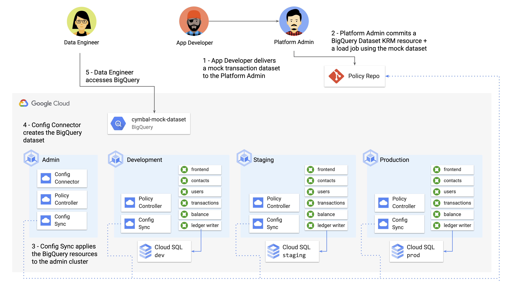
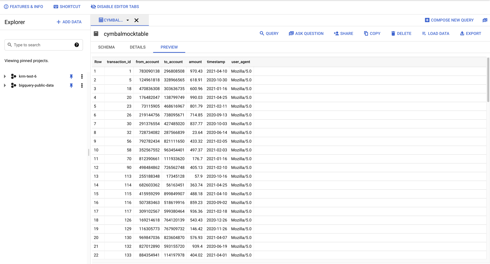

## Part B - Enforcing Policies on Cloud-Hosted Resources 

Let's come back to why using KRM for cloud resources is useful. First, when Config Sync works with Config Connector resources, the desired state in your Git policy repo - for instance, the size of a GCE compute disk - will constantly be reconciled by the admin cluster. This means that if the security admin who requested the GCE instance tries to manually change the resource, Config Sync will return the state back to the intent in the KRM file, by updating the live-running resource. 

Another reason to adopt KRM for cloud-hosted resources is because Config Connector integrates with Policy Controller, allowing you to define custom policies on your cloud-hosted resources in addition to your Kubernetes resources. This can help you impose guardrails on the types of cloud-hosted resources allowed, or on the parameters *within* a cloud-hosted resource. Those guardrails, in turn, can help large engineering orgs successfully adopt modern cloud products like [BigQuery](https://cloud.google.com/config-connector/docs/reference/resource-docs/bigquery/bigquerytable), [Firestore](https://cloud.google.com/config-connector/docs/reference/resource-docs/firestore/firestoreindex) or [Game Servers](https://cloud.google.com/config-connector/docs/reference/resource-docs/gameservices/gameservicesrealm), and do it safely.   

Let's see how to create a policy for a cloud-hosted resource lifecycled with Config Connector. Say that the data analytics team at Cymbal Bank wants to explore [BigQuery](https://cloud.google.com/bigquery/docs/introduction) to better understand Cymbal's customers. While the application engineering team is at work building a [Pub/Sub](https://cloud.google.com/dataflow/docs/guides/templates/provided-streaming#cloudpubsubsubscriptiontobigquery) export feature between the existing Cloud SQL databases and BigQuery, the analytics team wants to prepare by learning how to use BigQuery. As the platform team, we can enable the data analytics folks, while imposing guardrails on the kinds of datasets they import into the cloud.   

Let's see how. 




1. **View the mock transaction dataset.** This is a 1000-line CSV file, whose fields mimic the data currently stored in the Cloud SQL `ledger_db` today. 

```
head bigquery/cymbal-mock-transactions.csv 
```

Expected output: 

```
transaction_id,from_account,to_account,amount,timestamp,user_agent
1,783090138,296808508,$970.43,4/10/2021,Mozilla/5.0
2,065419094,460289381,$301.53,12/27/2020,AppleWebKit/537.36
3,963595720,549123263,$624.50,11/1/2020,Chrome/51.0.2704.103
4,389877011,027171468,$42.24,6/20/2020,Safari/537.36
5,124961818,328966565,$618.91,10/30/2020,Mozilla/5.0
6,267080812,814045028,$170.00,9/5/2020,AppleWebKit/537.36
7,760106461,999333329,$226.68,4/30/2021,Chrome/51.0.2704.103
8,337830129,789806989,$717.91,8/15/2020,Chrome/51.0.2704.103
9,145870222,311667375,$39.17,4/15/2021,Chrome/51.0.2704.103
```

2. **Verify that you have the gsutil tool installed** - this comes bundled with the gcloud command. [Install the tool](https://cloud.google.com/storage/docs/gsutil_install) if it's not in your PATH. 

```
gsutil version 
```

Expected output: 

```
gsutil version: 4.61
```

3. **Create a Cloud Storage bucket in your project, called `datasets`. **

```
gsutil mb -c standard gs://$PROJECT_ID-datasets
```

Expected output: 

```
Creating gs://krm-test-5-datasets/...
```

4. **Upload the mock transaction data to Cloud Storage.**

```
gsutil cp bigquery/cymbal-mock-transactions.csv  gs://${PROJECT_ID}-datasets/cymbal-mock-transactions.csv
```

Expected output: 

```
Copying file://bigquery/cymbal-mock-transactions.csv [Content-Type=text/csv]...
/ [1 files][ 56.6 KiB/ 56.6 KiB]
Operation completed over 1 objects/56.6 KiB.
```

5. **View the BigQuery Job, Table, and Dataset resources provided for you in the `bigquery` directory.** 

```
cat bigquery/mock-dataset.yaml 
```

Expected output: 

```
apiVersion: bigquery.cnrm.cloud.google.com/v1beta1
kind: BigQueryJob
metadata:
  name: cymbal-mock-load-job
  annotations:
    configsync.gke.io/cluster-name-selector: cymbal-admin
spec:
  location: "US"
  jobTimeoutMs: "600000"
  load:
    sourceUris:
      - "gs://krm-test-5-datasets/cymbal-mock-transactions.csv"
    destinationTable:
      tableRef:
        name: cymbalmocktable
    sourceFormat: "CSV"
    encoding: "UTF-8"
    fieldDelimiter: ","
    quote: '"'
    allowQuotedNewlines: false
    maxBadRecords: 0
    allowJaggedRows: false
    ignoreUnknownValues: false
    skipLeadingRows: 1
    autodetect: true
    writeDisposition: "WRITE_APPEND"
    schemaUpdateOptions:
      - "ALLOW_FIELD_ADDITION"
      - "ALLOW_FIELD_RELAXATION"
---
apiVersion: bigquery.cnrm.cloud.google.com/v1beta1
kind: BigQueryDataset
metadata:
  name: cymbalmockdataset
  annotations:
    configsync.gke.io/cluster-name-selector: cymbal-admin
spec:
  friendlyName: cymbal-mock-dataset
---
apiVersion: bigquery.cnrm.cloud.google.com/v1beta1
kind: BigQueryTable
metadata:
  name: cymbalmocktable
  annotations:
    configsync.gke.io/cluster-name-selector: cymbal-admin
spec:
  friendlyName: cymbal-mock-table
  datasetRef:
    name: cymbalmockdataset
```

Here, we define a BigQuery Table, `cymbal-mock-table`, referencing a new Dataset, `cymbal-mock-dataset`, whose data is loaded in from a BigQuery job, `cymbal-mock-load-job`, referencing the CSV file you just uploaded to Cloud Storage. 

6. **Replace the `PROJECT_ID` in the `gs://` URL in `mock-dataset.yaml` (line 12) with your `PROJECT_ID.`**

```
sed -i "s/PROJECT_ID/$PROJECT_ID/g" bigquery/mock-dataset.yaml 
```

7. **Apply the BigQuery resources to the admin cluster.** 

```
kubectx cymbal-admin
kubectl apply -f bigquery/mock-dataset.yaml 
```

Expected output: 

```
bigqueryjob.bigquery.cnrm.cloud.google.com/cymbal-mock-load-job created
bigquerydataset.bigquery.cnrm.cloud.google.com/cymbalmockdataset created
bigquerytable.bigquery.cnrm.cloud.google.com/cymbalmocktable created
```

8. **Get the GCP resource status, and wait for all the BigQuery resources to be `READY=True`** 

```
kubectl get gcp
```

Expected output: 

```
NAME                                                               AGE    READY   STATUS     STATUS AGE
bigquerydataset.bigquery.cnrm.cloud.google.com/cymbalmockdataset   109s   True    UpToDate   108s

NAME                                                           AGE    READY   STATUS     STATUS AGE
bigquerytable.bigquery.cnrm.cloud.google.com/cymbalmocktable   109s   True    UpToDate   107s

NAME                                                              AGE    READY   STATUS     STATUS AGE
bigqueryjob.bigquery.cnrm.cloud.google.com/cymbal-mock-load-job   109s   True    UpToDate   56s...
```

9. **Navigate to the Google Cloud Console > BigQuery.** In the left sidebar, click the drop-down next to your project. You should see a dataset called `cymbalmockdataset`, and beneath that, a table called `cymbalmocktable`. You should be able to click **Preview** and see the mock dataset table. 



Now let's come back to the restrictions we outlined at the beginning of this section- for now, the only allowed BigQuery dataset allowed in this (beyond the public datasets) is the one we just created. Let's create a resource name restriction policy to lock down any other BigQuery resources from being commited to the policy repo. Also note that in a real use case, we would lock down BigQuery Table and Dataset creation permissions to the Config Connector Google Service Account only, using Google Cloud IAM to restrict Cymbal Bank analytics team permissions to the `BigQuery Viewer` role only. This would block users from creating BigQuery resources from the console, as well. 

10. View the Policy Controller resources in the `bigquery/` directory. This file defines a constraint template for `BigQueryDatasetAllowName`, and a constraint of type `BigQueryDatasetAllowName`, which together allow only one BigQuery dataset in the policy repo - the one we already created, `cymbalmockdataset`. 

```
cat bigquery/constraint-template.yaml
cat bigquery/constraint.yaml
```

Expected output: 

```
apiVersion: templates.gatekeeper.sh/v1beta1
kind: ConstraintTemplate
metadata:
  name: bigquerydatasetallowname
spec:
  crd:
    spec:
      names:
        kind: BigQueryDatasetAllowName
      validation:
        openAPIV3Schema:
          properties:
            allowedName:
              type: string
  targets:
    - target: admission.k8s.gatekeeper.sh
      rego: |
        package bigquerydatasetallowname
        violation[{"msg": msg}] {
          input.review.object.kind == "BigQueryDataset"
          input.review.object.metadata.name != input.parameters.allowedName
          msg := sprintf("The BigQuery dataset name %v is not allowed", [input.review.object.metadata.name])
        }apiVersion: constraints.gatekeeper.sh/v1beta1
kind: BigQueryDatasetAllowName
metadata:
  name: bigquery-allow-mock-only
spec:
  parameters:
    allowedName: cymbalmockdataset
```

11. **Apply the Constraint and Constraint Template** (again, in a real use case we'd push these policies to the policy repo, and have Config Sync apply them to the cluster.)

```
kubectx cymbal-admin
kubectl apply -f bigquery/constraint-template.yaml
kubectl apply -f bigquery/constraint.yaml
```

Expected output: 

```
constrainttemplate.templates.gatekeeper.sh/bigquerydatasetallowname created
bigquerydatasetallowname.constraints.gatekeeper.sh/bigquery-allow-mock-only created
```

12. **Attempt to manually create a new dataset, called `helloworld-dataset`.** This should fail because it violates the policy of only allowing the mock dataset. 

```
kubectl apply -f bigquery/helloworld-dataset.yaml 
```

Expected output: 

```
Error from server ([denied by bigquery-allow-mock-only] The BigQuery dataset name helloworld is not allowed): error when creating "bigquery/helloworld-dataset.yaml": admission webhook "validation.gatekeeper.sh" denied the request: [denied by bigquery-allow-mock-only] The BigQuery dataset name helloworld is not allowed
```

**🏆 Great job!** You just enabled the Analytics team to try out BigQuery, while enforcing a policy on new dataset creation. 

**[Continue to part C.](partC-existing-resources.md)**